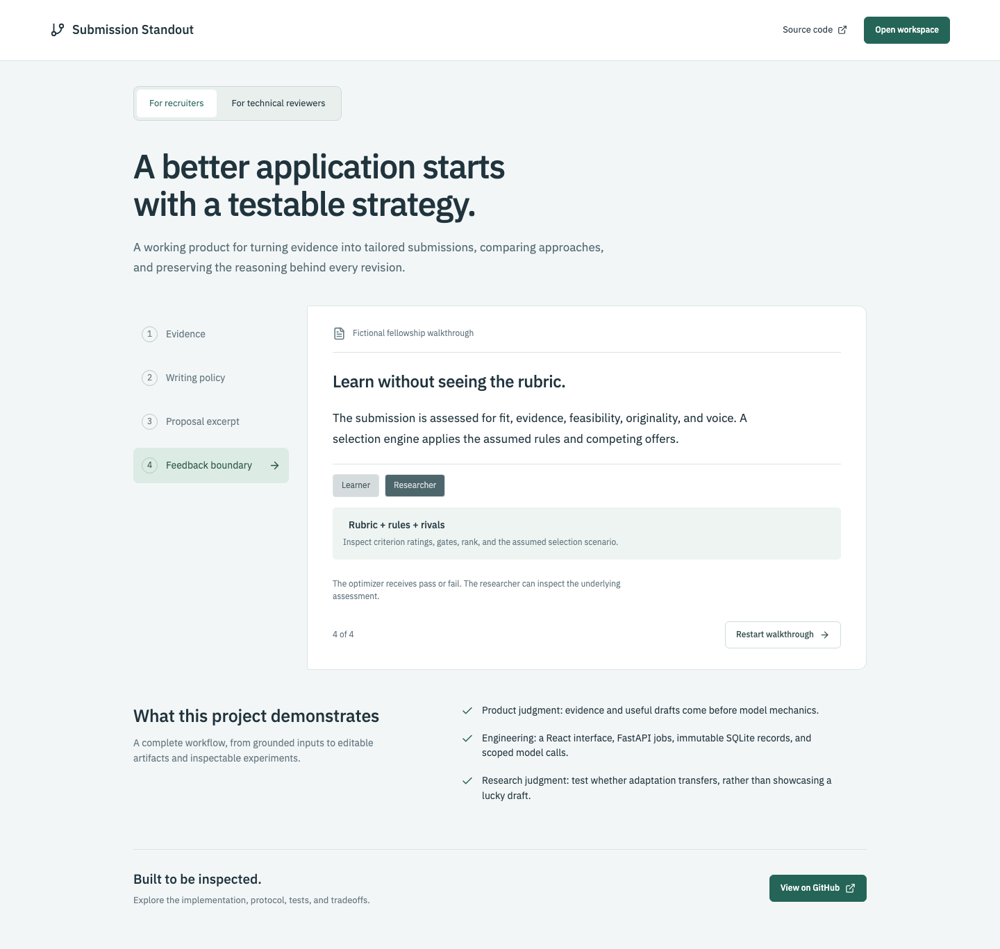

# Submission Standout

See the [research protocol](docs/research-protocol.md) for the relationship to Che's scoring auctions, proposed controlled experiments, and the limits of current simulation results.

**[Open the product tour](https://puedesleerlo.github.io/submission_standout/)** · [Recruiter and technical demo guide](docs/showcase-guide.md)



A local workbench for developing application packages and comparing versioned submission strategies under hidden selection scenarios.

The submission studio uses **Kimi K3** to infer judging scenarios, develop competing writing strategies, draft applications, assess their quality, and explore new policy versions using binary selection feedback. The original reference simulator remains available separately for protocol checks.

Start with a posting and applicant evidence, then click **Develop submission**. Read, edit, copy, or download the drafts. **Explore next round** asks the strategist to refine, explore, or combine approaches using only prior pass/fail observations. Detailed scores and critiques remain in your observer interface.

## Run locally

For repeatable agent access, see the [MCP and reusable-bank guide](docs/agent-interface.md). The **Reusable banks** view keeps source-backed facts, experience cases, company profiles, professional contacts, and hiring signals available across projects. Import selected revisions into an opportunity without changing older snapshots. Unadvertised opportunities can leave their deadline blank.

Requires Node.js 22+, pnpm 10, and [uv](https://docs.astral.sh/uv/). Python 3.11+ is managed by uv.

```sh
pnpm install
uv sync
pnpm dev
```

In a second terminal:

```sh
pnpm access
```

Open the printed sign-in link. The application runs at `http://127.0.0.1:5173`; the API runs on port 8000. The browser exchanges the link's access key for an HttpOnly session cookie and removes the key from the address bar. Both servers bind to loopback.

The public tour is at `/showcase`. The **Research study** navigation item opens controlled experiments. GitHub Pages serves only the static tour: it has no connected backend, private dossiers, access credentials, or model-call capability. The workflow in `.github/workflows/showcase.yml` rebuilds it from `main`.

## Controlled research studies

Register opportunities into training, validation, and test partitions. Related institution names, exact duplicate postings, and user-defined families cannot cross splits. Semantically similar postings still require human grouping. Postings, evidence, constraints, model identity, prompt hashes, budgets, and seeds are snapshotted at registration.

The backend enforces `created → training → trained → validation → frozen → test → completed`. Validation chooses between two training finalists per method using mean pass rate across opportunities; a stable policy-ID tie-break is recorded. All five selected policies are frozen before any test call. No stage can be reopened. Research samples use separate record types and never enter studio optimization history.

- **Fixed drafting:** the same predeclared instructions, with repeated fresh drafts.
- **Random exploration:** two new reusable policies per round, without history.
- **Binary adaptation:** policies can use only previous training pass/fail observations and prior policies.
- **Full feedback:** a deliberately privileged baseline with training assessments and decision diagnostics.
- **Shuffled feedback:** the same binary optimizer prompt with training labels reassigned across observations. The marginal pass count is preserved; the optimizer is not told it is in the shuffled arm. Uniform outcomes make this control uninformative.

Methods share identical draft/judge slots and call ceilings; fixed drafting leaves its unused proposal allowance unspent. This is an equal-allowance comparison, not equal realized dollar cost. Actual calls, tokens, and model elapsed time appear separately. Each opportunity has a shared frozen set of 12 competitive worlds. Draft replicates are separate stateless generation calls; provider-level generation determinism is not guaranteed.

Before each paid stage, the server checks that its maximum call allowance fits the remaining UTC daily budget. Insufficient budget leaves the stage unstarted. The six-opportunity fictional pilot has one training, one validation, and four test institutions; its stage ceilings are 91, 41, and 84 calls respectively. These are illustrative data, not a scientific benchmark. With the default 100-call daily cap, stages may need different days. To run a larger study, explicitly configure `STANDOUT_MAX_MODEL_CALLS` on the server before starting. Provider failures retain partial records and stop the study; they are not negative rewards or automatically retried.

Test results average worlds and replicates within each opportunity, then average opportunities equally. The UI shows paired differences against fixed drafting and 95% family-cluster bootstrap intervals (2,000 resamples), withholding intervals below three complete test families. Only opportunities complete for all five methods enter comparisons. Small pilots and multiple comparisons do not support confirmatory claims.

After testing, create a separate **blind review link**. It reveals only randomized documents, postings, and supporting evidence. A human rates clarity, specificity, credibility, feasibility, and recommendation; method labels and model assessments remain hidden. Reviews are immutable and excluded from optimization. This first version supports one review per document, with descriptive opportunity-averaged results; partial coverage can bias comparisons. Reviewer links are local capability URLs, not an internet collaboration deployment.

Exports contain scoped prompts, results, policies, freeze manifests, judgments, paired worlds, budget ledgers, and reviews. Reviewer access tokens are excluded. Protocol enforcement protects the application's workflow, not against a human manually reusing known test data or a process with direct database access. Re-registering a previously inspected test set does not make it a fresh holdout.

### Kimi configuration

The backend reads `MOONSHOT_API_KEY` from its environment or, if absent, from the sibling `../big_learning_gym/.env` requested by the user. Only this key is loaded; the Gym's other settings and data are not imported. The source file is not modified, and the key is never copied into the frontend or experiment records.

Use `STANDOUT_LLM_ENV_FILE` to point to another server-side env file. `STANDOUT_LLM_MODEL` defaults to `kimi-k3`. Requests go to `https://api.moonshot.ai/v1/chat/completions` using low reasoning effort and JSON output. `STANDOUT_MAX_MODEL_CALLS` defaults to 100 per UTC day, counting attempted calls. The application records token usage; dollar cost is unknown and shown as provider-billed, not zero.

## What works

- Create projects with a posting, institutional context, focus terms, a deadline, and reservation conditions.
- Add evidence in experience, research, artifact, idea, and institution banks. Institution evidence enters shared context. Applicant facts remain private until selected into a package.
- Develop two executable prompt strategies with hypotheses, tradeoffs, evidence choices, and a recorded rationale. Subsequent versions can explore, branch, or merge.
- Generate proposals, cover letters, resumes, or supporting statements from the supplied facts. Edit and save immutable versions; copy or download Markdown.
- Build a personalized rubric and three competing selection scenarios from the posting and supplied institutional context.
- Use semantic Kimi assessments, including factual grounding and anti-boilerplate voice review, then apply explicit selection rules in code.
- Compare documents in 12 matched counterfactual worlds. Each package faces an independent copy of the same rival pool, avoiding competition between experimental treatments.
- Inspect scores, gates, scenario weights, and rivals as the observer. The learner feedback endpoint returns exactly `{"passed": true}` or `{"passed": false}`.
- Replay allocation from saved judgments and export full observer data, including model inputs, outputs, token usage, policy lineage, and binary observations.
- Run background jobs with visible stages, deduplication, partial-output preservation, and restart recovery. Model failures do not become negative rewards.

The first launch seeds one fictional fellowship, four evidence items, three reference strategies, and a 36-decision reference comparison. Kimi work is generated only when a round is started. Create a separate project for your own opportunity.

## Experiment semantics

The live workflow has four stateless model roles:

1. **Selector designer:** receives only the public posting/context and requested artifact type. Returns institutional interests, uncertainty, rubric anchors, three scenario hypotheses, and three synthetic rival archetypes.
2. **Strategist:** receives public context, private applicant evidence, constraints, the user's brief, prior policy instructions, and binary outcomes. Returns two executable writing policies, parent references, and concise reflections.
3. **Writer:** receives its policy and selected evidence. Writes a complete document and a claim-to-evidence map. It never receives hidden scenario parameters or private critiques.
4. **Judge:** receives the document, attached evidence, public context, and the personalized rubric. It does not receive the generating strategy or previous results. Returns five semantic ratings plus quality, integrity, and format diagnostics for the observer.

The controller samples and freezes 12 environments using the selector designer's scenario probabilities and counterfactual rival feature means. Preference weights, scenario probabilities, and rival feature variation remain distinct. Kimi's judgment of each document is reused across these worlds; twelve trials are not twelve independent model judgments. The rules support ranking, an acceptance threshold, a per-criterion veto, and an assumed late-window reduction in rolling capacity. Voice carries at least 15% of every scenario's weights and has a noncompensatory minimum of 60/100. These are declared research conventions, not discovered institutional rules.

Subsequent rounds reuse the frozen selector and worlds until public context or document type changes, or you explicitly rebuild the assumptions. The strategist's history is constructed from an explicit allowlist: policy ID, package ID, and pass/fail. No scores, rejection causes, scenario labels, rival ratings, or judge critiques enter that history. Each policy saves the exact binary history it received.

This implements bounded **prompt-policy search**, not neural-weight training. New strategy proposals may refine or merge existing instructions or explore a new root. The system preserves every branch; it does not automatically declare a champion. A first round uses at most six calls, an iteration five, and reassessing one saved draft one.

### Reference laboratory

The original compositor still executes four typed controls: opening emphasis, evidence count, milestone count, and alternative comparison. Reference strategy hypotheses are notes rather than executable prompts. Kimi policies and documents cannot accidentally run through this legacy evaluator.

The reference rubric measures focus-term coverage, retained evidence passages, plan structure, hypothesis/comparison terms, and stock writing phrases. It is deliberately simple and easy to game. It does not establish truth, genuine novelty, feasibility, or human writing quality. Its style check is neither an AI detector nor the final voice-review system.

Three fixed illustrative preference scenarios are sampled with probabilities 45%, 30%, and 25%. Within each scenario, candidates are ranked by weighted feature scores against four synthetic rival profiles for two places, after deadline, word-count, and evidence gates. Scenario probabilities and within-scenario weights are separate quantities. The suite is recorded as `illustrative-suite-v1`.

For either studio evaluator, reported fractions are **passes in simulated trials, not estimated real acceptance probabilities**. A comparison of fixed documents does not establish generative policy quality across opportunities. Reusing practice environments can overfit; the separate Research study workflow evaluates frozen policies on held-out opportunities. A replay verifies deterministic allocation from saved assessments, not reproducibility of a fresh LLM judgment.

Every run records immutable policy and package references, public context snapshots, evidence snapshots, paired world hashes, seed, evaluator versions, binary observations, private diagnostics, intervention provenance, usage, and events. Full model requests and validated final responses are observer-only exports. Provider secrets and private model reasoning are not stored. Human edits are marked, and derived claim maps are cleared until reviewed again. Treat these as research traces, not proof that a policy improves real selection outcomes.

## Storage and access boundaries

The prototype uses FastAPI, SQLite, React, TypeScript, and Vite. Bounded background threads run live agent jobs without holding database transactions over model calls. SQLite replaces the proposed PostgreSQL/worker deployment for this local slice; records are append-only through the service API and final run writes are transactional.

Local state is under `.local/` (ignored by Git):

- `standout.sqlite3` and SQLite WAL files: project and experiment records.
- `access.json`: independent random observer and learner credentials, created with owner-only file permissions.

`STANDOUT_DATA_DIR` overrides the data directory. `STANDOUT_API_PORT` and `STANDOUT_WEB_PORT` override the ports when running the development servers; use the same environment for `pnpm access`. Model calls send the role's scoped inputs to Moonshot. There is no external database, telemetry, or automatic submission service.

The API enforces role separation, including when an observer cookie accompanies a learner bearer token. **This is a trusted, single-user local application, not an agent sandbox or multi-tenant service.** Any process with filesystem access can read the database and keys. Future learner workers must receive only their API capability, without the selector source, database, observer exports, or host filesystem access. A browser tab hiding scores is not the security boundary.

Useful API routes (all except health require credentials):

| Purpose | Route |
| --- | --- |
| Observer workspace | `GET /api/projects/{project_id}` |
| Model configuration status (no secrets) | `GET /api/model` |
| Studio outputs and job progress | `GET /api/projects/{project_id}/studio` |
| Develop, iterate, or evaluate a saved draft | `POST /api/projects/{project_id}/agent-jobs` |
| Create a policy version | `POST /api/projects/{project_id}/policies` |
| Generate a saved package | `POST /api/projects/{project_id}/packages` |
| Run a comparison | `POST /api/projects/{project_id}/runs` |
| Full observer export | `GET /api/projects/{project_id}/export` |
| Learner's public context and private applicant inputs | `GET /api/learner/projects/{project_id}` |
| Run without returning diagnostics | `POST /api/learner/projects/{project_id}/runs` |
| Binary feedback only | `GET /api/learner/projects/{project_id}/trials/{trial_id}` |

Use `Authorization: Bearer <role-key>` for workers. A run request contains exactly one of `policy_ids` or `package_ids`, plus `worlds` (1–30), `seed`, `delay_days`, and a unique `request_key`. Repeating a request key with identical inputs returns the same run; changing its inputs returns 409. Runs using saved packages require identical public context hashes and one document per policy version. Infrastructure or validation failures are errors, never negative rewards.

The reference `runs` routes above retain their original contract. For live work, an observer starts an agent job with `{mode, artifact_type, brief, request_key}`. Modes are `develop`, `iterate`, and `evaluate`; evaluation also requires `package_id`. The endpoint returns 202 and a job handle. Poll the studio endpoint for progress and output references. Requests are idempotent, and a project permits one active round at a time. Server restarts mark interrupted rounds as failed; they never silently repeat paid requests.

## Verification

```sh
pnpm build
pnpm test
pnpm exec playwright install chromium
pnpm test:e2e
```

Backend tests cover access separation, hidden-information sentinel checks, provider error and secret handling, binary response shapes, matched worlds, idempotency, rollback, revisions, deadline/voice gates, restart recovery, replay, and persistence. Browser tests exercise both live-agent orchestration with a deterministic test provider and the reference workflow. They use isolated temporary databases on ports 5174/8001, make no paid model calls, and do not change your workspace. Screenshots are saved in `test-results/`. Actual Kimi integration is verified separately with explicitly started local jobs.

## Next implementation stage

Add public web research and source ingestion; independently verify claims and reservation-condition compliance; extend reusable evidence banks; isolate external tool-using workers; and run adequately powered held-out studies with independent reviewers. Cross-model judging and multiple reviewers per document remain future work. Current agents use only the sources you supply, and Kimi's style and integrity assessments still require human review. Rival profiles and inferred weights are assumptions, not recovered facts about a real selection process.

See [the system design](docs/system-design.md) for the broader architecture, theory, algorithms, agent capabilities, and staged implementation plan. The document describes the target system; not every capability is implemented in this prototype.
