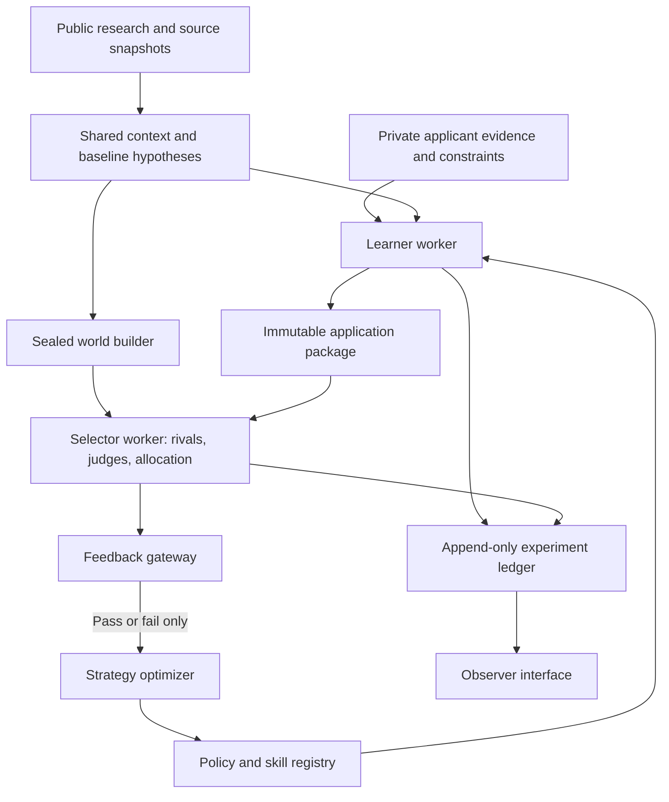

# Submission Standout — system design

Version: 0.1 · 2026-09-20 · Proposed architecture

This document specifies the target system. Numerical examples below illustrate configuration; they are not estimates about an actual institution or applicant population.

**Implementation status, 2026-09-20:** the local studio now connects Kimi K3 to four scoped roles: selector design, strategy search, writing, and semantic judging. It develops two executable prompt strategies per round, creates editable artifacts, evaluates them in frozen counterfactual worlds, and proposes subsequent policy versions from binary feedback only. The reference laboratory remains separate. React, FastAPI, SQLite, background job progress, immutable traces, saved-judgment replay, and complete observer exports are implemented. Public web research, independent fact/constraint verification, external-worker sandboxing, PostgreSQL deployment, held-out evaluation, calibrated scenario priors, and policy promotion remain planned. See the [README](../README.md) for exact operational scope and limitations.

## 1. Product and research objective

Develop truthful, distinctive submissions while learning which reusable strategies work under uncertain selection processes. Support jobs, grants, and fellowships through domain adapters, with one domain implemented and evaluated first. A research-fellowship adapter is the provisional first slice because it exercises proposals, CVs, institutional interests, and limited places; this is a reversible implementation choice.

The unit of learning is a **submission strategy**: a versioned program composed of prompts, skills, retrieval rules, planning choices, editorial constraints, and resource-allocation decisions. An application document is an output of that strategy, not the strategy itself.

Two objectives must remain distinguishable:

1. Practical use: produce a strong package for a particular opportunity within the applicant's constraints.
2. Research: test whether an optimizer improves strategies across opportunities under a declared feedback protocol and budget.

Do not attribute the success of selecting one lucky document to general improvement of the generating policy. Evaluate both fixed-artifact performance and fresh artifacts generated by a policy, and label these estimands separately.

Non-goals for the first version: survival analysis, autonomous external submission, a psychological replica of an actual reviewer, exact real-world acceptance probabilities, equilibrium claims, or training a foundation model from scratch. Prompt templates will follow these contracts in a later implementation step.

## 2. What transfers from Che and negotiation theory

Che models bids as quality and price, distinguishes the buyer's utility from the scoring rule, and analyzes several allocation/payment rules. His main auction analysis assumes bidders know the scoring rule; his equilibrium results also rely on specific cost, distribution, and commitment assumptions. We will reuse multidimensional offers, explicit tradeoffs, applicant delivery costs, and outside options. We will not transplant his optimal scoring formula or equilibrium bidding rules to opaque hiring or fellowship processes. First-score allocation is a useful baseline when the winning proposal becomes the commitment. Second-score rules are not a default for applications. [1]

Our extension represents an offer as:

`offer = {proposed_value, deliverables, scope, schedule, requested_resources, evidence, commitments}`

For fixed-award fellowships, requested funding may be constant or absent. Do not manufacture a price dimension or encourage an applicant to offer a lower salary without an explicit choice. Separate existing qualifications, feasible future commitments, and how the submission communicates them.

Negotiation concepts become explicit fields:

- **Institutional interests:** problems to solve and outcomes to obtain.
- **Institutional outside options:** other applicants, an internal solution, postponement, or selecting nobody.
- **Tradeoffs:** permissible substitutions among scope, ambition, cost, timing, and evidence.
- **Applicant reservation conditions:** minimum acceptable terms, time limits, location constraints, intellectual commitments, and delivery capacity.

A feasible-offer checker rejects strategies that win by violating applicant constraints or inventing qualifications. Optimizing selection probability is subject to these constraints. An optional later objective can optimize applicant value net of effort; it must be recorded as a separate objective rather than silently replacing binary acceptance.

## 3. Architecture and information boundaries

Use a modular application with separate learner and selector worker identities. These are access boundaries, not merely different system prompts.



Four data scopes:

- `shared_context`: the same version of the posting, public evidence, published criteria, and baseline scenario hypotheses is available to both sides.
- `applicant_private`: full evidence banks, writing samples, feasible offers, reservation conditions, drafts, learner histories, and strategies. Selectors see only what is submitted or available through explicitly permitted public verification.
- `selector_private`: sampled scenario parameters, reviewer prompts, rival dossiers/packages, randomness, internal scores, allocation state, and explanations.
- `observer`: a trusted user can inspect all three scopes. Observer exports are not mounted in learner workspaces.

The baseline distribution can be public; the scenario sampled for a particular trial remains hidden. Sharing baseline hypotheses does not disclose the actual environment state.

The research service publishes immutable context snapshots. Freeze a snapshot within a comparison batch. New research creates a new context version and a new experimental condition. In a later research-action experiment, log all newly retrieved observations and their costs instead of pretending the input remained fixed.

A learner and a selector must not share conversation memory, writable scratch space, retrieval indexes, or unrestricted database credentials. A trusted controller routes requests and logs outcomes but does not feed private diagnostics into the optimizer. Cache keys include visibility scope and every material input version.

Only a terminal simulated decision returns `{"passed": true}` or `{"passed": false}` as selection feedback. An opaque receipt may accompany it; it must not encode scenario type or rejection cause. Infrastructure failures remain failed jobs, not negative rewards. Real applications may remain pending; that is an administrative state, not a failure observation.

## 4. Evidence and information required

### Public institutional dossier

Collect and preserve:

- Original posting, attachments, eligibility, evaluation criteria, submission format, timeline, number of places, budget, and disclosed selection stages.
- Current strategy, funded work, products, research agenda, annual reports, public talks, and documented problems or needs.
- Previous winners and their work **as known at the time of selection**, including cohort and program-year context.
- Publicly available reviewer or team professional work relevant to the opportunity, with reviewer identity marked confirmed, plausible, or unknown.
- Evidence of rolling review, reopening, deadlines, staffing urgency, screening software, or human/AI review stages. Unknown remains unknown.
- Conflicting signals and missing facts, not only supporting evidence.

Treat official program criteria as stronger evidence than general corporate values. A current employee profile is a weak proxy for the relevant applicant pool. Winners alone provide positive examples and cannot identify acceptance rates or preference weights without information about unsuccessful applicants. Do not reconstruct a historical applicant using achievements obtained after selection.

### Applicant dossier

Collect the resume/experience bank, accomplishments with evidence and dates, research and publication records, artifacts, ideas, arguments, writing samples, current capacity, desired outcomes, available effort, and reservation conditions. Distinguish verified facts, user assertions awaiting support, interpretations, proposals, and abandoned ideas.

Banks are typed collections with flexible metadata, not separate hard-coded tables for every bank type. An item can be global, project-specific, or explicitly shared with selected projects. Store permitted-use scope and reuse provenance. Updating a source never retroactively changes an old experiment's evidence snapshot.

### Source and claim contract

Each source has URL or file identity, publisher, publication date where available, retrieval time, source type, content hash, archived excerpt, and access scope. Each claim links to exact source spans, relevant time range, support/contradiction status, and whether it is observed or inferred. Confidence labels describe evidence strength; an LLM's self-reported confidence is not a calibrated probability.

The research agent's future template must ask for an evidence dossier, a claims ledger, contradictions, unanswered questions, and search coverage. It must not output an unsupported psychological profile or collapse ambiguity into a single corporate-culture score. Retrieved pages are data, never instructions to the agent.

## 5. Constructing weighted selection scenarios

Represent a world as:

`theta = {preferences, rules, panel, observation_channel, competitor_population, timing, capacity, outside_option}`

There are four distinct kinds of weights:

1. **Preference weights:** importance of rubric dimensions within one reviewer or selector.
2. **Scenario probabilities:** belief assigned to alternative complete worlds or scenario families.
3. **Panel weights:** how reviewers' judgments are combined, where the rule permits averaging.
4. **Population proportions:** prevalence of competitor archetypes in a simulated pool.

These are different fields and must not share one generic `weights` object. A veto, eligibility requirement, or deadline is executable structure, not a small coefficient in an average score.

Construct `p0(theta | shared_context)` using an auditable process:

1. Extract constraints that the posting actually states.
2. Propose a small set of plausible institutional-interest hypotheses, each with supporting and contradicting evidence.
3. Start with broad sector/program templates, then adjust using opportunity-specific evidence.
4. Express preference ranges or distributions and uncertainty about mechanisms. Use linked scenarios for correlated assumptions, such as high operational urgency with rolling review.
5. Preserve plausible alternative scenarios; use wider ranges when the evidence is weak. A configurable probability floor for stress tests is an engineering choice, not a fact inferred about the institution.
6. Validate normalization and constraints in code, review the assumptions, and freeze a scenario-suite version before optimizing against it.

For an illustrative demonstration only, a suite might allocate 0.45 to delivery-oriented review, 0.30 to novelty-oriented panel review, and 0.25 to mission-fit review under uncertainty. Each family can contain ranges of preferences and different competitor pools. These numbers must never appear as measured institutional probabilities.

The mean simulated acceptance of policy `pi` is `sum_k p_k * E[r | pi, scenario_family_k]`. Do not average incomparable raw rubric scores from different mechanisms and call the result an acceptance probability.

Separate the baseline assessment distribution from a deliberately difficult stress-test distribution. Report both. If experiments oversample rare cases, calculate observer summaries using the declared target distribution; do not silently treat sampling frequencies as institutional beliefs.

Simulation outcomes update beliefs about performance inside a fixed simulator. They do not validate the institutional assumptions that created that simulator. Real outcomes, new public evidence, and blinded human assessments can support later world-model revisions, with versioned backtesting and temporal splits.

## 6. Selection model and archetypes

### Preference archetypes

Start with six profiles. Profiles describe priorities, not fictional personalities or named people.

- **Frontier discovery:** novelty, intellectual significance, original evidence, upside.
- **Reliable delivery:** execution record, clear milestones, readiness, time to useful results.
- **Domain depth:** methodological rigor, specialist knowledge, technically credible detail.
- **Mission contribution:** fit to documented needs, specific contribution, relevance to current work.
- **Resource stewardship:** feasibility, cost realism, evidence strength, manageable delivery risk.
- **Complementary contribution:** useful capabilities missing from the existing team or proposed cohort.

Profiles can combine within a reviewer or panel. Preference dimensions need not be inherently opposed: novelty and feasibility can both score well. Tradeoffs arise from the actual feasible offers, evidence, and resource constraints.

### Rule families

Implement rules as typed code modules with explicit parameters:

- `threshold`: pass required gates and minimum dimension/overall levels.
- `top_k`: select up to K eligible packages exceeding the outside-option threshold; specify tie-breaking.
- `panel`: aggregate independent reviewer features, or require consensus; configured vetoes remain non-compensatory.
- `cohort`: select a feasible set that combines individual value and complementarity under capacity or funding constraints.
- `rolling`: process a timestamped arrival sequence; capacity updates as decisions occur, with a declared stopping rule.
- `scoring_offer`: compare multidimensional offers including resources requested where applicable; a first-score-style baseline awards the submitted feasible commitment.

The first implementation needs eligibility plus threshold/top-K, a weighted panel, and a simple rolling-capacity rule. Cohort optimization and negotiation after selection can follow once the experiment pipeline is sound. Grants with different requested budgets need an allocation rule that respects a total budget rather than pretending all awards have equal cost.

### Observation channels, including AI-mediated selection

The selector evaluates what its review process can observe. Support channels such as full-document reading, brief review with limited attention, extracted structured fields, keyword/semantic retrieval, and AI-screen-then-human-panel. These are scenario components, not universal facts about institutions.

LLM review can be strategically relevant. An AI-mediated suite should test concise evidence, explicit terminology, extraction-friendly structure, and other plausible reading effects. Separately maintain a substantive-quality evaluation so that exploiting one judge's preferences is visible. Evidence that an institution uses an AI product raises the relevance of that family; it does not establish the product's prompt or scoring behavior. Report generalization across model families, prompt variants, and document ordering. [2]

### Executable selection pipeline

1. Parse the submitted package through the configured observation channel.
2. Check declared eligibility and document constraints. Verify claims only using submitted evidence and allowed sources.
3. Ask rubric judges for anchored feature ratings and evidence locations.
4. Validate the ratings and apply thresholds, nonlinear interactions, vetoes, resource constraints, and timing in code.
5. Compare eligible candidates with rivals and the institution's outside option.
6. Persist the full decision privately; release one binary decision to the learner.

A baseline compensatory reviewer can use `u = sum_j w_j * g_j(q_j) + interactions - resource_penalty`, where ratings `q`, transforms `g`, weights, and interactions are versioned. This is one model, not a universal formula. Selection is `allocate(utilities, gates, rival_packages, capacity, time, outside_option)`.

LLMs interpret text and identify evidence. Code performs arithmetic, sampling, sorting, budget checks, deadline calculations, and the final configured allocation. Judges do not improvise new selection criteria while evaluating a batch.

## 7. Rubrics and writing quality

Keep three distinct rubric objects:

- **Published requirements:** extracted from the opportunity; shared.
- **Applicant quality rubric:** a public, evidence-informed writing and feasibility checklist available to the drafting pipeline.
- **Instantiated selection rubric:** hidden parameters used by a particular simulated selector, derived from a frozen scenario specification.

Use a common dimension vocabulary but permit domain-specific additions: relevance, evidence/credibility, originality, feasibility, methods, execution record, contribution, resource realism, clarity, and voice. A dimension includes behavioral anchors, applicability, missing-evidence treatment, and source references. Unsupported is different from false; unavailable evidence should not silently turn into a claimed lack of capability.

Illustrative dimension contract:

```json
{
  "dimension_id": "claim_specificity",
  "scale": [0, 1, 2, 3, 4],
  "anchors": {
    "0": "Key claims are generic and have no concrete support.",
    "1": "A few concrete details appear, but key claims remain unsupported.",
    "2": "Some central claims have relevant examples; important gaps remain.",
    "3": "Most central claims have specific and relevant support.",
    "4": "Every material claim is specific and supported or clearly framed as a proposal."
  },
  "required_judge_output": ["rating", "evidence_spans", "missing_support", "brief_rationale"],
  "applies_to": ["cover_letter", "proposal"],
  "not_applicable_policy": "exclude_only_if_allowed_by_rubric_version"
}
```

Normalize weights over applicable dimensions only under a declared rule. Show score scales and evidence coverage, not a falsely precise universal quality percentage. Different rubric versions define different measurements.

The applicant quality rubric always covers generic institutional praise, unsupported superlatives, repeated claims, empty abstraction, formulaic transitions, unnecessary symmetry, and inconsistency with the user's own voice. Editing should preserve meaning and evidence, not merely remove a list of words or add artificial imperfections. Require passage-level flags and check whether the proposed edit resolves the specific defect.

This requirement applies to every strategy. Realistic selectors may differ in how much they care about voice; do not force all simulated institutions to share the user's editorial preferences. Keep hard constraints such as truthful claims and reservation conditions separate from stylistic ratings. No AI-authorship detector is used as the writing objective.

## 8. Competitor and submission-strategy libraries

### Competitor archetypes

Seed a configurable library with an established specialist, a proven operator, a candidate closely aligned with institutional work, an original but less proven challenger, a cross-disciplinary translator, a candidate with strong credential signals but variable direct evidence, and a polished generalist.

Separate a competitor's underlying qualifications from its presentation strategy. Any archetype can have excellent or poor writing; any can use AI. Generate correlated dossiers with feasible career timelines and then generate their packages using versioned competitor policies. Do not attach fabricated accomplishments to named people. Public winners ground aggregate patterns and illustrative archetypes rather than becoming asserted current competitors.

Start with a few explicit pool-strength scenarios, not a purported population distribution. Freeze rival packages for paired comparisons and reserve unseen pools for validation. Default rivals do not inspect our current submission. Adversarial rivals that do inspect or adapt to it belong to a separately labeled stress-test or co-evolution experiment.

### Initial submission strategies

- **Evidence first:** open with the strongest directly relevant accomplishment; connect each claim to proof.
- **Problem and contribution:** organize around a documented institutional problem and the applicant's specific contribution.
- **Distinctive thesis:** present an original, defensible idea with a clear test and realistic boundaries.
- **Execution plan:** emphasize milestones, methods, available resources, dependencies, and delivery credibility.
- **Bridge strategy:** show how experience from another field solves a specific problem here.
- **Concise proof portfolio:** prioritize compact claims linked to inspectable work samples.

All share truthful-claim checks, voice requirements, format compliance, and reservation conditions. Strategies choose emphasis, evidence, structure, feasible offer, research effort, and timing. They cannot change the applicant's historical facts. Weakness analysis must distinguish an evidence gap, a presentation gap, and a qualification gap that drafting cannot repair.

## 9. Policy representation and version control

A policy is a structured manifest plus versioned text modules. Use a directed acyclic graph for ancestry, not one mutable prompt field. Skill versions are reusable capabilities; policy versions specify how to combine and parameterize them.

Illustrative manifest:

```json
{
  "policy_id": "problem_contribution",
  "version_id": "pv_0003",
  "parents": ["pv_0001", "pv_0002"],
  "operation": "merge",
  "hypothesis": "Combine problem-led framing with evidence-led opening.",
  "scope": {"domain": "research_fellowship", "artifacts": ["proposal", "cv"]},
  "modules": {
    "retrieval": "skill.evidence_mapping@1",
    "planning": "prompt.problem_contribution@2",
    "writing": "skill.proposal_composition@1",
    "verification": "skill.claim_audit@1",
    "editing": "skill.voice_editing@1"
  },
  "budget": {"max_model_calls": 12, "max_revision_rounds": 2},
  "immutable_constraints_ref": "applicant_constraints_v1",
  "feedback_protocol": "binary_selection_v1",
  "content_hash": "computed_when_saved"
}
```

An evaluation references a policy version; scores do not live as a single mutable property of the policy. A registry maintains branch pointers and scoped champion references, such as `champion:research_fellowship:context_v2:protocol_v1`. Preserve specialists and uncertainty rather than deleting every non-champion.

Git can store exported prompts, skills, manifests, and source code. The database stores ancestry, run references, model configurations, evaluations, and promotion decisions. A merge produces a new tested version, not an assumption that two successful prompts remain successful when concatenated.

## 10. Agents and capabilities

Use logical roles with narrow input/output contracts. Several roles can use the same base model and execute sequentially; ten roles do not require ten persistent agents or services. Worker credentials, not role names, enforce separation.

1. **Public research agent — shared.** Search/browse, source extraction, deduplication, temporal checking, and contradiction tracking. Produces the public dossier and unresolved questions. It cannot inspect hidden evaluations.
2. **Evidence curator — applicant.** Parse resumes and artifacts, normalize accomplishments, map claims to support, and enforce reuse scope. Produces a private evidence snapshot and gaps.
3. **Institution analyst — shared.** Translate public evidence into interests, constraints, plausible process stages, and baseline hypotheses with supporting/counterevidence. Produces a hypothesis ledger; code validates distributions.
4. **World designer — selector.** Convert frozen hypotheses into scenario configurations and sample private worlds. Produces environment versions. It does not edit the suite in response to a learner's failures during an experiment.
5. **Competitor builder — selector.** Construct plausible synthetic dossiers and application packages under sampled population assumptions. Produces fixed rival pools with provenance and generation settings.
6. **Submission planner/writer — applicant.** Choose a feasible offer and evidence, build an argument, and compose a coordinated package. Resume, cover-letter, grant, and fellowship writing are specialized skills selected by the policy.
7. **Editorial and evidence critic — applicant.** Independently check claims, voice, clarity, cross-document consistency, and public requirements. Produces revision suggestions from allowed inputs. Its local feedback is not the selector's feedback.
8. **Rubric reviewer — selector.** Rate observable submissions against frozen anchors and identify supporting spans. May run as several independent panel members; code performs aggregation/allocation.
9. **Policy proposer/optimizer — learner.** Inspect allowed traces and binary outcomes; propose, mutate, combine, and allocate trials to policies. It cannot query private scenario scores or observer analysis.
10. **Experiment analyst — observer.** Compare strategies, diagnose failure patterns, inspect sensitivity, and prepare user explanations. Its suggestions become explicitly recorded human/observer-assisted interventions if fed back into learning.

The deterministic controller schedules work, enforces budgets, handles retries, snapshots inputs, checks output schemas, maintains idempotency, records events, and releases only permitted feedback. It is not another free-form decision-making agent.

Reusable skill contracts required for the first implementation:

- `opportunity_extract`: posting -> structured requirements and unresolved fields.
- `institution_research`: search brief -> sourced shared dossier.
- `selection_hypotheses`: dossier -> plausible interests/processes and evidentiary support.
- `evidence_mapping`: private bank + requirements -> claim/evidence/gap map.
- `offer_design`: constraints + context -> feasible contribution packages.
- `submission_outline`: chosen offer + policy -> argument plan and evidence allocation.
- `resume_tailoring`, `cover_letter_composition`, `proposal_composition`: domain-specific artifact generation.
- `claim_audit`, `voice_editing`, `package_consistency`: local quality control.
- `rubric_assessment`: submitted package + hidden rubric -> structured reviewer observations.
- `policy_reflection`: allowed traces + binary results -> hypothesis and proposed patch.

Every skill specifies allowed input scopes, tool access, output schema, budgets, error handling, and its own immutable version. Source gathering and hypothesis generation must remain separable so that different analysts can use the same source snapshot.

## 11. Central learning algorithms

### Two nested loops

The inner loop executes one policy: retrieve evidence, plan, draft, perform local checks, revise within budget, and produce an immutable package. The outer loop chooses policies, obtains binary selection outcomes, and proposes new versions. A local revision before submission is not a new environment trial until it is actually evaluated.

The initial formulation is a contextual bandit over versioned strategies: public opportunity features form the context, the chosen strategy is the action, and terminal selection is the binary reward. Later, research, revision, and submit-now decisions can become explicit sequential actions with resource costs. The one-shot external application and the many simulated training trials are separate objects.

### Versioned evolutionary search with binary feedback

```text
freeze context, applicant evidence, scenario suite, splits, and budgets
register baseline policies and immutable skill versions
initialize an archive of policy versions

while experiment budget remains:
    choose an operation: evaluate, refine, explore, or merge
    choose parent versions using allowed binary histories and public contexts
    propose a candidate manifest and a testable change hypothesis
    validate its constraints, module references, scope, and budget

    draw a paired batch through the sealed evaluation controller
    execute candidate and comparator on the same public opportunities
    evaluate against matched hidden worlds and frozen rival packages
    return only binary decisions for each trial to the learner
    append full private evaluations to the observer ledger

    compare candidate and comparator using binary outcomes
    update estimates; preserve promising, distinct, and uncertain candidates
    schedule further trials or archive the candidate

at preregistered checkpoints:
    compare eligible versions on a separate promotion-validation set
    promote a champion under the declared binary-feedback objective

after search is frozen:
    run an untouched audit set and prepare observer diagnostics
```

Use a fixed initial quota of trials before elimination and a reserved exploration budget. The exact quotas and promotion thresholds are configurable experimental settings. Prefer paired differences across matched opportunities and worlds; evaluate multiple fresh generations per policy when measuring the generator. Account for clustering by opportunity rather than treating every repeated judge call as an independent application.

Each side of a paired comparison starts from a separate copy of the same initial world. In a rolling or cohort process, evaluating the candidate must not consume capacity or change the rival pool for its comparator. Unless explicitly testing direct head-to-head competition, substitute each package into the same reference pool in separate episodes.

Start with simple allocation and paired comparisons; add Thompson sampling over a fixed active set of policy versions after the data contract is stable. A Beta-Bernoulli model is a baseline only within a declared, reasonably stationary context stratum. Correlated repeats and changing opportunity mixtures do not justify naive independent-trial certainty. A new prompt version is a new arm: do not inherit its parent's successes as if they were observations of the child. Hierarchical sharing can be a later explicit model.

Store the allocator's action probabilities when they are actually known. For algorithms whose propensities are intractable, record the algorithm/configuration and mark propensities unavailable or estimated; never fabricate them. A deterministic, selectively logged history is not automatically suitable for unbiased off-policy evaluation.

### Complementarity and robust optimization without feedback leakage

The learner can retain a frontier over public opportunity strata, observed binary performance, and its own costs. The observer can additionally calculate a frontier by hidden scenario family. These are different views.

In the default protocol, a private scenario-performance matrix cannot control parent selection, merges, trial allocation, or automatic promotion. Otherwise the learner receives extra information even if its visible response is binary. The public baseline hypotheses can guide proposals; actual hidden-world labels remain sealed.

There are three honest ways to use robustness:

1. **Default:** optimize expected binary success under a frozen mixed environment; inspect per-family robustness in the observer view.
2. **Robust challenge extension:** define a public challenge protocol whose single pass/fail result summarizes a sealed bundle of worlds using a predeclared rule. For example, pass requires a minimum acceptance fraction within each included family. This is a different binary task; log its definition and charge every internal evaluation to its cost. Avoid an overly difficult rule that produces almost all failures.
3. **Observer-assisted deployment:** after freezing the experiment, the user selects a policy using private robustness diagnostics. Record that decision as observer-assisted; do not claim it was learned through binary feedback alone.

### Preference inference and research actions

The learner may maintain its own beliefs about selector preferences using public evidence, its submissions, and binary outcomes. This learner belief state is distinct from the environment designer's hidden configuration. Sparse outcomes usually leave several explanations compatible with the observations.

Later, choose research actions by estimated decision value: would resolving this uncertainty change the offer, strategy, or submit time enough to justify the effort? Start with bounded heuristics such as resolving unknown eligibility or confirming a deadline. Do not imply a precisely calculated value of information when its inputs are only guesses.

## 12. Methods for training or improving a policy

Implement methods as interchangeable optimizer adapters, not as assumptions embedded in the data model.

**Fixed and random baselines — first.** A stable prompt, ordinary local revision, random policy mutation, and best-of-N drafting establish whether adaptive search adds value. Count all drafting and judging calls in comparable budgets; best-of-N is artifact selection, not necessarily policy improvement.

**Reflective prompt evolution — initial adaptive method.** Mutate a module, propose a new strategy, or combine complementary versions. A GEPA-style archive and merge process is relevant. Its usual rich-feedback advantages cannot simply be assumed when the selector supplies only pass/fail. A custom adapter must sanitize reflection inputs to public context, applicant artifacts/actions, local critique, and observed binary outcomes. It must exclude hidden scores, gold explanations, rival content, and private scenario labels. [3]

**Bayesian search over prompts and demonstrations — comparison method.** MIPROv2-style optimization jointly searches instruction and example choices with a scalar metric. A binary acceptance metric fits that interface conceptually, but any demonstrations must come from permitted, appropriately scoped data. Successful private examples are not automatically reusable across applicants. [4]

**Bandit strategy routing — next.** Learn which existing strategy to use for a public context. This changes the routing policy, while prompt evolution changes the strategies themselves. Evaluate the two effects separately before combining them.

**Supervised fine-tuning — later.** Train on carefully selected successful traces or artifacts with their input contexts. Success-only imitation loses information about unsuccessful exploration; preserve failures and selection metadata in the research dataset. A simulator win is a label from that simulator, not ground truth about real quality.

**Preference optimization — later.** Construct comparisons from repeated, matched evaluations of competing outputs under the same relevant conditions. A single pass in one world and a single fail in another do not establish a valid preference pair. Record pair construction and uncertainty. This introduces a derived preference-training objective and must remain distinguishable from online binary optimization.

**Weight-based RL — only after the environment is credible.** Policy-gradient methods can use binary rewards without differentiating through the selector. This requires a model/training runtime that supports weight updates, sufficient sampled trajectories, and algorithm-specific likelihood data. PPO/GRPO-style training normally needs fresh on-policy or compatible rollouts; old API logs alone do not guarantee trainability. If token log probabilities, tokenizer versions, or exact checkpoints are unavailable, record that limitation. Do not fabricate hidden reasoning traces; log observable actions and explicit summaries the agents actually produced.

**Co-evolution — research extension.** Let rival policies adapt between frozen epochs, while retaining a reference league and untouched evaluation suite. This tests strategic adaptation but makes the environment nonstationary. It does not by itself establish a Nash equilibrium or simulate a real applicant market faithfully.

## 13. Experiment records and reproducibility

Use an append-only event ledger plus relational materialized views. Central entities:

- `SubmissionProject`, `OpportunityVersion`, `SourceSnapshot`, `EvidenceItemVersion`, `ContextSnapshot`, `ApplicantConstraintVersion`.
- `HypothesisSetVersion`, `ScenarioSuiteVersion`, `WorldInstance`, `CompetitorPoolVersion`, `RubricVersion`.
- `SkillVersion`, `PolicyVersion`, `PolicyParentEdge`, `ArtifactVersion`, `SubmissionPackageVersion`.
- `ExperimentProtocol`, `ExperimentRun`, `Trial`, `ActionEvent`, `FeedbackObservation`, `PrivateEvaluation`, `PromotionDecision`, `ExternalOutcome`.

Record per trial:

```text
identity: experiment_id, trial_id, paired_block_id, attempt_id
public inputs: opportunity_version, shared_context_hash, visible_requirement_version
private applicant inputs: evidence_snapshot, constraints_version, writing_reference_version
behavior: policy_version, skill_versions, prompts/messages actually sent, tool observations
generation: provider, model/checkpoint identifier, generation settings, seed if supported
outputs: package hash, component artifacts, claim/evidence links, self-critique
feedback: terminal binary observation exactly delivered, delivery timestamp
private environment: suite/world/pool/rubric versions, scores, allocation trace, judge outputs
cost: model calls, tokens, money, elapsed time, simulated elapsed time
optimization: parent versions, operation, allocator state, known action propensity
provenance: simulation / human assessment / real outcome; intervention labels
status: created / running / completed / infrastructure_error / canceled / pending_external
```

Separate simulated elapsed time from wall-clock/model latency. Timing assumptions are environment parameters. A faster API response should not automatically mean a candidate submitted earlier unless the protocol deliberately models it that way.

Persist original provider outputs and content-addressed artifacts. Seeds alone cannot ensure identical outputs from hosted models. Support exact replay of stored observations and re-execution as separate operations. Preserve errors and retries; do not count repeated delivery of one decision as new evidence.

Use idempotency keys for trial creation, package registration, and outcome ingestion. Log a human change of context, a manual policy edit, or observer-informed advice as an intervention; it starts a distinguishable condition.

## 14. Technical components and proposed stack

Begin with a modular monolith and two isolated worker roles, not a fleet of microservices.

- **Web UI:** React and TypeScript; pnpm for dependencies and scripts. Project, evidence, policy, and experiment views share typed API contracts.
- **API/domain layer:** Python with FastAPI and Pydantic-style schemas. Keep scenario allocation and experiment logic independent of the HTTP framework.
- **Database:** PostgreSQL for versioned entities, events, permissions, ancestry edges, and JSONB configuration. Full-text search first; add embeddings only when retrieval evaluation justifies them.
- **Artifact store:** local content-addressed files behind a storage interface during development; object storage when deployed. Store document renderings and source snapshots alongside their hashes.
- **Jobs:** a durable PostgreSQL-backed job table with leases, retry limits, and idempotency for the first deployment. Add a dedicated queue only when load or operational needs require it.
- **Learner/selector runners:** separate service accounts and workspaces; distinct database views and tool allowlists. The observer role can read diagnostics; learner credentials cannot.
- **Model gateway:** provider adapters, structured output validation, bounded retries, model/version logging, token/cost tracking, and role-scoped prompt assembly. Provider choice remains configurable.
- **Search/extraction adapter:** search provider, browser/fetch tools, document extraction, source archiving, and access-failure reporting. LinkedIn-specific access is optional; public bios and supplied exports can fill the same evidence contract.
- **Experiment engine:** seeded environment sampling, paired blocks, frozen pools, allocation rules, feedback filtering, and export of learner-safe versus complete research datasets.
- **Optimizer adapters:** custom binary-feedback evolutionary baseline first; optional GEPA/MIPRO experiments behind the same interface. Pin versions when implementation begins.

Conceptual API boundary:

```text
shared/applicant APIs
  create_project, import_evidence, publish_context_snapshot
  register_policy_version, generate_package, submit_trial, read_binary_observation

selector-internal APIs
  instantiate_world, build_competitor_pool, rate_packages, allocate_outcome

observer APIs
  inspect_trial, compare_policies, inspect_scenario_matrix, review_promotions
  export_complete_experiment, record_external_outcome
```

Authorization is enforced in the service and database/storage layer. Prompt wording alone is insufficient. A learner cannot use general search or an artifact download endpoint to retrieve sealed experiment files. Synthetic rival packages are not external source evidence and never enter shared retrieval indexes.

Each domain adapter defines its artifact schema, requirement extractor, rubric vocabulary, offer fields, reservation checks, and permitted timing/allocation models. Keep the core experiment engine domain-independent.

Evaluation is likely to dominate cost. With independent per-package judging, uncached work grows roughly with `trials × reviewers × (rival_count + 1)`, in addition to research, writing, and policy-proposal calls. Reuse rival ratings only when the complete judge input is identical; pairwise, contextual, or cohort assessments may invalidate that cache. Meter both generation and evaluation, cap total expenditure per experiment, and expose consumed versus remaining budget. Measure actual provider costs before setting default run sizes.

## 15. User-facing views

1. **Project brief:** goal, requirements, deadline, applicant constraints, and unresolved blockers.
2. **Evidence workspace:** bank items, provenance, use scope, claim support, contradictions, and missing evidence.
3. **Selection assumptions:** institutional interests, sources, scenario families, editable prior ranges, and what is known versus inferred.
4. **Submission studio:** coordinated documents, evidence annotations, voice edits, differences between versions, and feasible-offer checks.
5. **Policy lineage:** immutable versions, parent/merge edges, hypotheses, budgets, and scoped champion pointers.
6. **Experiment inspector:** an exact learner-view toggle next to the observer view. Show what feedback actually reached the optimizer, not just what the evaluator computed.
7. **Comparison view:** policy-by-scenario success matrix with uncertainty and sample counts, learning curves by budget, strengths/gaps, and failure sensitivity.
8. **Real-outcome ledger:** submissions, dates, pending status, actual decisions, and later calibration evidence.

The interface must distinguish simulated acceptance, local rubric quality, human preference, and external outcome. A single headline score would hide the distinctions this system is designed to investigate.

The strengths/gaps view should show binding constraints and supporting evidence. A statement such as “this strategy is fragile when feasibility dominates” is conditional sensitivity analysis, not an asserted explanation of a real rejection.

## 16. Validation and first implementation sequence

### Phase A: replayable vertical slice

Implement one project with a shared context snapshot, private evidence, two or three fixed policies, one rubric, frozen rival packages, and eligibility plus top-K selection. Complete the binary-feedback boundary and full trial inspection before adding adaptive optimization.

Acceptance criteria: reproduce an allocation from stored reviewer ratings; link every submitted factual claim to evidence or flag its unsupported status; show exactly what the learner saw; retry a failed job without duplicating its reward; prevent learner access to private scores and scenario labels.

### Phase B: weighted scenario suite

Add the six preference profiles, uncertainty ranges, panel and rolling rules, AI-mediated observation channels, and a small set of plausible competitor populations. Validate that small controlled input changes have the expected effect under deterministic toy judges before using LLM judgments.

Acceptance criteria: scenario weights normalize; vetoes remain vetoes; applicant reservation constraints cannot be optimized away; no selection occurs after capacity/deadline closure under the relevant rule; stronger evidence has predictable effects in controlled cases; institutional evidence is identical on both sides for a given snapshot.

### Phase C: policy optimization

Add mutation, branching, merges, binary-history allocation, scoped champions, and budget accounting. Compare against fixed, local-revision, random-mutation, and best-of-N baselines. Prefer a simple optimizer with inspectable behavior over a complicated algorithm whose feedback access is unclear.

Acceptance criteria: every new policy has a hypothesis and parents; only allowed information reaches proposal/promotion logic; complementary policies survive when justified by public-context performance; evaluation expenditure is included in budgets.

### Phase D: generalization and reality checks

Use disjoint search, promotion-validation, and final audit partitions. Split related opportunities by institution/program and time where possible; prevent near-duplicate postings and reused historical winners from straddling supposedly independent tests. Promotion validation is consumed by adaptive selection, so it is not the untouched final test. Run several independent search seeds and report uncertainty across opportunities/runs.

Include held-out judge variants, source snapshots, and rival pools; blinded human reviews; and real outcomes when they become available. Keep the simulator frozen during each experimental comparison. Judge disagreement and position/verbosity sensitivity are measurements, not reasons to abandon AI-mediated scenarios.

The first research claim should be narrow: under a stated family of environments and fixed budget, an adaptive method improves fresh generated submissions on untouched opportunities relative to the chosen baselines. Claims about real acceptance require separate evidence.

## 17. Inputs still needed and defaults

Before running the first actual project, obtain the original posting, applicant evidence, approved writing samples, reservation conditions, and a monetary/time budget. These cannot be responsibly invented. Institutional research can fill the public dossier; unknown selection mechanisms remain scenarios.

Default design decisions for implementation:

- One research-fellowship adapter first, with jobs and grants supported by the same contracts later.
- Frozen base model weights; optimize prompts, skill composition, and routing first.
- Binary selection feedback only; local writing critiques remain permitted.
- Public baseline hypotheses and shared source snapshots; private sampled worlds and rival packages.
- Human inspection of all diagnostics; observer-assisted interventions explicitly labeled.
- Internal generation/testing first; no automatic external submission.
- Confidence grounded in evidence, repeated trials, and held-out cases; no claimed true institutional weights.

Potential later decisions: provider/model choices, hosting, search access, export formats, whether the practical deployment champion should optimize average success or a robust challenge objective, and whether to train model weights after sufficient data exists.

## 18. Research references and limits of attribution

The architecture, contracts, archetype library, and implementation sequence above are proposed for this platform. Sources motivate particular mechanisms; they do not validate this application's effectiveness.

1. Yeon-Koo Che, *Design Competition through Multidimensional Auctions* (1993): [paper](https://kylewoodward.com/blog-data/pdfs/references/che-the-rand-journal-of-economics-1993A.pdf). Used for multidimensional offers, scoring versus utility, and auction assumptions.
2. Zheng et al., *Judging LLM-as-a-Judge with MT-Bench and Chatbot Arena* (2023): [paper](https://arxiv.org/abs/2306.05685). Documents judge capabilities and biases in its studied settings; does not establish how any particular employer screens applications.
3. Agrawal et al., *GEPA: Reflective Prompt Evolution Can Outperform Reinforcement Learning*: [paper](https://arxiv.org/abs/2507.19457), [official adapter guide](https://gepa-ai.github.io/gepa/guides/adapters/). Its reflection interface needs a deliberately restricted adapter for our binary-only selector feedback.
4. DSPy, *MIPROv2*: [official documentation source](https://github.com/stanfordnlp/dspy/blob/main/docs/docs/api/optimizers/MIPROv2.md); Opsahl-Ong et al., *Optimizing Instructions and Demonstrations for Multi-Stage Language Model Programs*: [paper](https://arxiv.org/abs/2406.11695). Motivates instruction/example search with measured task outcomes.
5. Harvard Program on Negotiation, [integrative negotiation and package design](https://www.pon.harvard.edu/daily/negotiation-skills-daily/find-more-value-at-the-bargaining-table/). Motivates interests, outside options, and issue tradeoffs; the one-shot selection simulator is our adaptation.
